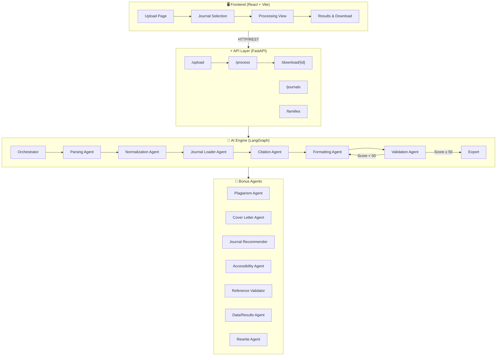
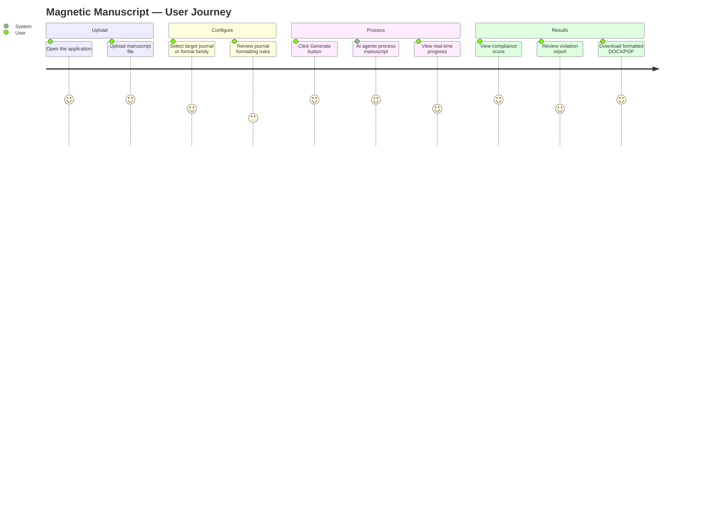

<p align="center">
  
  
  
  
  
</p>

<h1 align="center">🧲 Magnetic Manuscript</h1>

<p align="center">
  <strong>A production-grade, AI-powered, multi-agent academic manuscript formatting engine</strong>
</p>

<p align="center">
  <em>Transform raw research documents into fully publish-ready, journal-compliant manuscripts — without hallucinating a single word.</em>
</p>

<p align="center">
  <a href="https://magnetic-manuscript.vercel.app/"></a>
  <a href="https://magnetic-manuscript.onrender.com/docs"></a>
</p>

---

## 🌐 Live Demo

| Service | URL |
|---|---|
| 🖥️ **Frontend App** | [magnetic-manuscript.vercel.app](https://magnetic-manuscript.vercel.app/) |
| ⚡ **Backend API** | [magnetic-manuscript.onrender.com](https://magnetic-manuscript.onrender.com) |
| 📄 **API Docs (Swagger)** | [magnetic-manuscript.onrender.com/docs](https://magnetic-manuscript.onrender.com/docs) |

> **Note:** The backend is hosted on Render's free tier, so the first request may take ~30 seconds if the server has spun down due to inactivity.

---

## 📖 Table of Contents

- [Live Demo](#-live-demo)
- [Overview](#-overview)
- [Key Features](#-key-features)
- [Tech Stack](#%EF%B8%8F-tech-stack)
- [System Architecture](#-system-architecture)
- [Agent Pipeline Flow](#-agent-pipeline-flow)
- [User Flow](#-user-flow)
- [Supported Journals & Formats](#-supported-journals--formats)
- [Repository Structure](#-repository-structure)
- [Setup & Installation](#-setup--installation)
- [API Endpoints](#-api-endpoints)
- [Test Results](#-test-results)
- [Contributing](#-contributing)
- [License](#-license)

---

## 🧠 Overview

**Magnetic Manuscript** is a sophisticated formatting engine that leverages a **multi-agent AI architecture** powered by **LangGraph** and **Groq** to convert raw research documents into fully formatted, journal-compliant academic manuscripts.

Whether you're submitting to *Nature*, *IEEE Transactions*, *The Lancet*, or need a standard *APA* format — Magnetic Manuscript perfectly aligns your document structure, citations, and layout to meet rigorous academic standards.

> **🎯 Core Philosophy**: Use AI agents for *intelligent decision-making* (structure analysis, section identification) while relying on *deterministic code* for formatting — ensuring **zero hallucination** of core content.

---

## ✨ Key Features

| Feature | Description |
|---|---|
| 📄 **Multi-Format Parsing** | Supports `.docx`, `.pdf`, `.txt`, and `.md` file uploads |
| 🤖 **AI Multi-Agent Orchestra** | 12 specialized LangGraph agents working in concert |
| 📚 **Citation Engine** | Auto-detect & convert across 8 citation styles |
| 📏 **Compliance Scoring** | Automated 0–100 scoring against journal-specific rules |
| 🔄 **Self-Healing Pipeline** | Auto-retries formatting if compliance score drops below 50 |
| 📖 **Cover Letter Generator** | AI-generated journal submission cover letters |
| 🔍 **Plagiarism Detection** | Built-in similarity analysis engine |
| ♿ **Accessibility Checks** | Ensures readability and accessibility standards |
| 📊 **Data/Results Formatting** | Intelligent table and figure formatting |
| 📥 **Export** | Publish-ready `.docx` and `.pdf` output |

---

## ⚙️ Tech Stack

### Frontend

| Technology | Purpose |
|---|---|
| **React 19** | UI Framework |
| **Vite 7** | Build Tool & Dev Server |
| **TailwindCSS 4** | Utility-First Styling |
| **React Router 7** | Client-Side Routing |
| **Axios** | HTTP Client |
| **Lucide React** | Icon Library |

### Backend

| Technology | Purpose |
|---|---|
| **Python** | Core Language |
| **FastAPI** | REST API Framework |
| **Uvicorn** | ASGI Server |
| **LangChain** | LLM Orchestration Framework |
| **LangGraph** | Multi-Agent State Machine |
| **Groq** | LLM Inference (`kimi-k2-instruct`) |

### Document Processing

| Technology | Purpose |
|---|---|
| **python-docx** | Word Document Read/Write |
| **pdfplumber** | PDF Text Extraction |
| **markdown** | Markdown Parsing |
| **pandoc** | PDF Export |
| **citeproc-py** | Citation Style Processing |
| **bibtexparser** | BibTeX Parsing |

---

## 🏗 System Architecture



---

## 🔄 Agent Pipeline Flow

The heart of Magnetic Manuscript is its **sequential multi-agent pipeline**. Each agent processes the manuscript state and passes it to the next:

```
┌─────────────┐    ┌──────────────────┐    ┌─────────────────┐
│   📄 Parse   │───▶│  🔧 Normalize     │───▶│  📘 Load Rules   │
│  (Extract)   │    │  (Structure)      │    │  (Journal Cfg)   │
└─────────────┘    └──────────────────┘    └─────────────────┘
                                                     │
                   ┌──────────────────┐              ▼
                   │  ✅ Validate      │◀───┌─────────────────┐
                   │  (Compliance)     │    │  📚 Citations     │
                   └──────────────────┘    │  (Convert Style)  │
                          │                └─────────────────┘
              ┌───────────┴───────────┐
              ▼                       ▼
     ┌────────────┐          ┌────────────────┐
     │ Score ≥ 50  │          │  Score < 50     │
     │  ✅ Pass    │          │  🔄 Re-format   │
     └─────┬──────┘          └────────────────┘
           ▼
   ┌──────────────┐
   │  📦 Export    │
   │  DOCX + PDF   │
   └──────────────┘
```

---

## 👤 User Flow



---

## 📚 Supported Journals & Formats

### Format Families (8)

| Family | Citation Style | Key Journals |
|---|---|---|
| **IEEE Numeric** | `[1], [2]` numbered | IEEE Transactions, ACM |
| **APA Author-Date** | `(Author, Year)` | Psychology, Social Sciences |
| **Vancouver Numeric** | Superscript numbered | The Lancet, JAMA, BMJ |
| **Nature Style** | Superscript numbered | Nature, Science |
| **Springer IMRaD** | Numbered brackets | Springer Nature |
| **Elsevier Standard** | Numbered | Applied Energy, Materials |
| **Chicago Notes** | Footnotes/Endnotes | Humanities, History |
| **ACS Standard** | Superscript numbered | ACS Nano, Chemistry |

### Specific Journals (20)

<details>
<summary>Click to expand full journal list</summary>

| Journal | Publisher | Format Family |
|---|---|---|
| IEEE Transactions | IEEE | IEEE Numeric |
| Nature | Springer Nature | Nature Style |
| Science | AAAS | Nature Style |
| The Lancet | Elsevier | Vancouver Numeric |
| JAMA | AMA | Vancouver Numeric |
| Cell | Elsevier | Nature Style |
| PLOS ONE | PLOS | Vancouver Numeric |
| Frontiers | Frontiers Media | Vancouver Numeric |
| BMC Biology | BioMed Central | Vancouver Numeric |
| Springer Nature | Springer | Springer IMRaD |
| Elsevier Applied Energy | Elsevier | Elsevier Standard |
| ACM Computing Surveys | ACM | IEEE Numeric |
| ACS Nano | ACS | ACS Standard |
| APS Physical Review | APS | IEEE Numeric |
| Cambridge University Press | CUP | Chicago Notes |
| MDPI Sensors | MDPI | Vancouver Numeric |
| Oxford Academic | OUP | Vancouver Numeric |
| SAGE Publications | SAGE | APA Author-Date |
| Taylor & Francis | T&F | APA Author-Date |
| Wiley Advanced Materials | Wiley | Nature Style |

</details>

---

## 📂 Repository Structure

```
Magnetic-Manuscript/
│
├── 📁 backend/                        # Python FastAPI Backend
│   ├── 📁 agents/                     # LangGraph AI Agents
│   │   ├── orchestrator.py            #   ├─ Pipeline orchestrator & state machine
│   │   ├── parsing_agent.py           #   ├─ Multi-format document parser
│   │   ├── normalization_agent.py     #   ├─ Structure normalizer
│   │   ├── journal_loader_agent.py    #   ├─ Journal rule loader
│   │   ├── citation_agent.py          #   ├─ Citation style converter
│   │   ├── formatting_agent.py        #   ├─ DOCX formatting engine
│   │   ├── validation_agent.py        #   ├─ Compliance validator
│   │   ├── plagiarism_agent.py        #   ├─ Similarity checker
│   │   ├── rewrite_agent.py           #   ├─ AI-powered rewriter
│   │   ├── cover_letter_agent.py      #   ├─ Cover letter generator
│   │   ├── journal_recommender_agent.py  # ├─ Journal recommender
│   │   ├── accessibility_agent.py     #   ├─ Accessibility checker
│   │   ├── reference_validation_agent.py # ├─ Reference validator
│   │   └── data_results_agent.py      #   └─ Data/results formatter
│   │
│   ├── 📁 services/                   # Core Deterministic Services
│   │   ├── file_parser.py             #   ├─ DOCX/PDF/TXT/MD extraction
│   │   ├── citation_converter.py      #   ├─ Citation style conversion
│   │   ├── document_formatter.py      #   ├─ Deterministic DOCX builder
│   │   ├── compliance_checker.py      #   ├─ Rule-based scoring engine
│   │   ├── equation_engine.py         #   ├─ LaTeX equation handler
│   │   ├── bibtex_exporter.py         #   ├─ BibTeX export service
│   │   └── reference_validator.py     #   └─ Reference integrity checker
│   │
│   ├── 📁 journal_rules/              # Journal Configuration
│   │   ├── 📁 families/               #   ├─ 8 format family definitions
│   │   └── 📁 journals/               #   └─ 20 specific journal configs
│   │
│   ├── 📁 utils/                      # Utilities
│   │   ├── state.py                   #   ├─ LangGraph state schema
│   │   └── helpers.py                 #   └─ Shared helper functions
│   │
│   ├── main.py                        # FastAPI application entry point
│   ├── requirements.txt               # Python dependencies
│   └── .env.example                   # Environment variable template
│
├── 📁 frontend/                       # React + Vite Frontend
│   ├── 📁 src/
│   │   ├── 📁 pages/
│   │   │   ├── UploadPage.jsx         #   ├─ File upload interface
│   │   │   ├── JournalSelectionPage.jsx  # ├─ Journal picker
│   │   │   ├── ProcessingPage.jsx     #   ├─ Live progress tracker
│   │   │   └── ResultsPage.jsx        #   └─ Results & download
│   │   ├── 📁 components/
│   │   │   └── Header.jsx             #   └─ App header
│   │   ├── App.jsx                    #   ├─ Root component & routing
│   │   ├── api.js                     #   ├─ API client layer
│   │   ├── index.css                  #   └─ Global styles
│   │   └── main.jsx                   #   └─ App entry point
│   │
│   ├── index.html                     # HTML template
│   ├── package.json                   # Node dependencies
│   ├── vite.config.js                 # Vite configuration
│   └── eslint.config.js               # ESLint configuration
│
├── .gitignore                         # Git ignore rules
└── README.md                          # You are here ✨
```

---

## 🛠️ Setup & Installation

### Prerequisites

| Tool | Version | Purpose |
|---|---|---|
| **Python** | ≥ 3.10 | Backend runtime |
| **Node.js** | ≥ 18 | Frontend runtime |
| **npm** | ≥ 9 | Package manager |
| **Groq API Key** | — | LLM inference ([Get one free](https://console.groq.com)) |

### 1️⃣ Clone the Repository

```bash
git clone https://github.com/aanandmodi/Magnetic-Manuscript.git
cd Magnetic-Manuscript
```

### 2️⃣ Backend Setup

```bash
# Navigate to backend
cd backend

# Create and activate virtual environment
python -m venv venv
source venv/bin/activate        # macOS/Linux
venv\Scripts\activate           # Windows

# Install dependencies
pip install -r requirements.txt

# Configure environment
cp .env.example .env
# Edit .env and add your Groq API key:
# GROQ_API_KEY=gsk_your_key_here

# Start the server
uvicorn main:app --reload --port 8000
```

### 3️⃣ Frontend Setup

```bash
# Navigate to frontend
cd frontend

# Install dependencies
npm install

# Start the dev server
npm run dev
```

### 4️⃣ Open the Application

| Service | URL |
|---|---|
| 🖥️ **Frontend** | [http://localhost:5173](http://localhost:5173) |
| ⚡ **Backend API** | [http://localhost:8000](http://localhost:8000) |
| 📄 **API Docs** | [http://localhost:8000/docs](http://localhost:8000/docs) |

---

## 📡 API Endpoints

| Method | Endpoint | Description |
|---|---|---|
| `GET` | `/health` | Health check |
| `GET` | `/journals` | List all supported specific journals |
| `GET` | `/families` | List all format families |
| `GET` | `/journals/{name}` | Get specific journal rules |
| `POST` | `/upload` | Upload a manuscript file |
| `POST` | `/process` | Start the formatting pipeline |
| `GET` | `/download/{id}` | Download the formatted manuscript |

---

## 🧪 Test Results

Results from the latest end-to-end system test:

| Metric | Result |
|---|---|
| **Pipeline Status** | ✅ All 6 core agents passed |
| **Compliance Score** | 🟢 **88 / 100** |
| **Checks Passed** | 9 / 10 |
| **Violations** | 0 |
| **Warnings** | 1 minor |
| **DOCX Output** | 39 KB formatted document |
| **API Endpoints** | All 7 responding correctly |

---

## 🤝 Contributing

Contributions are welcome! Please follow these steps:

1. **Fork** the repository
2. **Create** a feature branch (`git checkout -b feature/amazing-feature`)
3. **Commit** your changes (`git commit -m 'Add amazing feature'`)
4. **Push** to the branch (`git push origin feature/amazing-feature`)
5. **Open** a Pull Request

---

## 📄 License

This project is licensed under the **MIT License** — see the [LICENSE](LICENSE) file for details.

---

<p align="center">
  <strong>Built with ❤️ by <a href="https://github.com/Abhishek-Ag-1112">Abhishek Agarwal</a></strong>
</p>

<p align="center">
  <em>If you found this helpful, consider giving it a ⭐</em>
</p>
